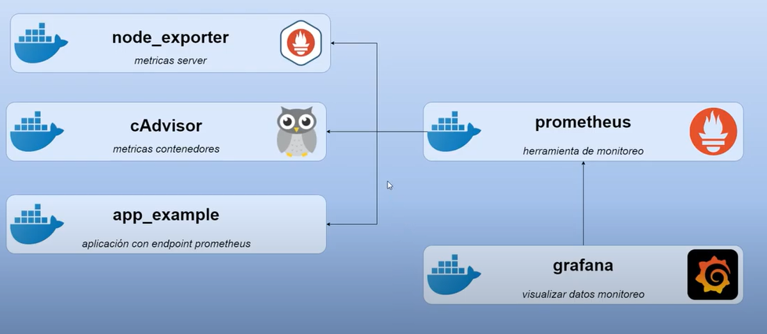

# Monitoreo

> Basado en el [video de Caos Binario](https://youtu.be/PCJwJpbln6Q)

## Introducción

En DevOps es fundamental el monitoreo de recursos, métricas y logs. Lo hacemos con Docker ya que nos permitirá generar nuestros archivos y luego simplemente tendremos que utilizarlos para monitorear nuestros servidores.


## Tipos de monitoreo

* Monitoreo a nivel servidor (RAM, CPU, Disco)
* Monitoreo a nivel contenedores (conocimiento de recursos por cada uno).
* Monitoreo a nivel aplicaciones (para por ejemplo conocer la cantidad de conexiones a la DB que está haciendo o la cantidad de requests x segundo que está recibiendo)
* Monitoreo de logs (a nivel servidor y a aplicación)

Vamos a centralizar todo esto en Grafana. Tendremos un servidor central que usamos para monitoreo y servidores donde están corriendo las aplicaciones.


## Contenedores de Monitoreo



> Los sentidos de las flechas indican desde dónde me conecto a dónde. Es decir que desde Grafana me conecto a Prometheus.

### node_exporter

Nos permite obtener las métricas del consumo de recursos (ram, cpu, disco) a nivel servidor. Herramienta creada por los creadores de Prometheus.

### cAdvisor

Nos permite obtener las métricas del consumo de recursos (ram, cpu, disco, networking) a nivel contenedores. Herramienta creada por Google.

### app_example

Aplicación de ejemplo con el endpoint de Prometheus activado. Importando una librería de modo que dentro de la aplicación exista un endpoint que devuelve info.

### prometheus

Es el encargado de recolectar toda la información de las métricas y almacenarla en la base de datos. Desde Prometheus me conecto a los otros tres contenedores que expondrán un endpoint en el cual publicarán sus métricas y almacenamos ese diferencial.

### grafana

Herramienta que utilizaremos para visualizar los datos monitoreados.


## `docker-compose.yml`

```
version: "3.7"

volumes:
  grafana-data:
  prometheus-data:    

services:
  grafana:
    image: grafana/grafana:8.0.6
    container_name: grafana
    restart: unless-stopped
    volumes:
    - grafana-data:/var/lib/grafana
    ports:
    - 3000:3000

  prometheus:
    image: prom/prometheus:v2.28.1
    container_name: prometheus
    restart: unless-stopped
    volumes:
    - ./prometheus.yml:/etc/prometheus/prometheus.yml
    - prometheus-data:/prometheus
    ports:
    - 9090:9090
    command:
    - '--config.file=/etc/prometheus/prometheus.yml'
    - '--storage.tsdb.path=/prometheus'
    - '--storage.tsdb.retention.time=1y'
    - '--web.enable-lifecycle'

  node_exporter:
    image: quay.io/prometheus/node-exporter:latest
    container_name: node_exporter
    restart: unless-stopped
    ports:
    - 9100:9100
    ###### linux
    # command:
    # - '--path.rootfs=/host'
    # pid: host
    # volumes:
    # - '/:/host:ro,rslave'
    ###### windows
    volumes:
      - /proc:/host/proc:ro
      - /sys:/host/sys:ro
    command: 
      - '--path.procfs=/host/proc' 
      - '--path.sysfs=/host/sys'
      - --collector.filesystem.ignored-mount-points
      - "^/(sys|proc|dev|host|etc|rootfs/var/lib/docker/containers|rootfs/var/lib/docker/overlay2|rootfs/run/docker/netns|rootfs/var/lib/docker/aufs)($$|/)"
        
  cadvisor:
    image: gcr.io/cadvisor/cadvisor:latest
    container_name: cadvisor
    restart: unless-stopped
    expose:
    - 8080
    volumes:
    - /:/rootfs:ro
    - /var/run:/var/run:rw
    - /sys:/sys:ro
    - /var/lib/docker/:/var/lib/docker:ro
    
  app_example:
    image: quay.io/brancz/prometheus-example-app:v0.3.0
    container_name: app_example
    restart: unless-stopped
    ports:
    - 80:8080
```


## `prometheus.yml`

```
global:
  scrape_interval:     15s # Set the scrape interval to every 15 seconds. Default is every 1 minute.
  evaluation_interval: 15s # Evaluate rules every 15 seconds. The default is every 1 minute.

scrape_configs:
  - job_name: 'prometheus'
    static_configs:
    - targets: ['prometheus:9090']
    
  - job_name: 'cadvisor'
    static_configs:
    - targets: ['cadvisor:8080']

  - job_name: 'node_exporter'
    static_configs:
    - targets: ['node_exporter:9100']    

  - job_name: 'app_example'
    static_configs:
    - targets: ['app_example:8080'] 
    #metrics_path: '/metrics'
    #metrics_path: '/prometheus'
```


Descargamos las imagenes

```
docker-compose pull
```

Levantamos los servicios con:

```
docker-compose up -d
```

Con `docker ps` o con `docker-compose ps` (desde el directorio donde tenemos el `docker-compose.yml`) podremos ver los contenedores corriendo.

* En http://localhost y veremos: **Hello from example application.**

* En http://localhost/metrics y veremos unas métricas de la aplicación.

* En http://localhost:9090/targets veremos todos los jobs que está monitoreando Prometheus.

* En http://localhost:9100/metrics veremos las métricas de node_exporter.

* En http://localhost:3000/ accedemos a Grafana y vamos a Configuration -> Datasources. Add data source y elegimos Prometheus. En la URL podemos poner simplemente **prometheus:9090** por estar dentro del mismo compose lo resuelve con el DNS interno de Docker. Presionamos por último **Save & test**. Luego vamos a **Explore** y hacemos click en **Metrics browser**.

  Aparecerá un desplegable **1. Select a metric** con todas las métricas disponibles.

  En el panel **2. Select labels to search in** podremos ingresar "job" y luego nos filtrará las métricas de esa tarea.

  Luego elegir de elegir la deseada hacemos click en **Use query**.


## Dashboards 

En [grafana.com/grafana/dashboards](https://grafana.com/grafana/dashboards/) encontramos Dashboards creados por la comunidad si escribimos por ejemplo "node exporter" nos aparecen algunos como:

**Para Node Exporter:**

* 1 Node Exporter for Prometheus Dashboard EN v20201010.
*  Node Exporter Full.

**Para cAdvisor:**

* Docker-cAdvisor.

  

Veremos que nos ofrece el id de esos dashboard y los copiamos para luego importarlos. 

Luego haciendo click en el signo + luego en **Import** veremos un input **Import via grafana.com** donde pegamos ese id, nos cargará toda la info y nos pedirá que indiquemos qué Prometheus estamos utilizando (elegimos nuestro datasource).