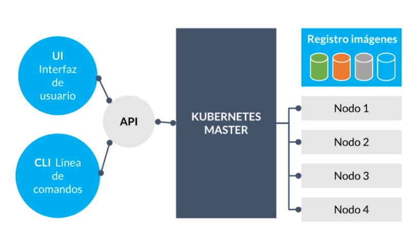
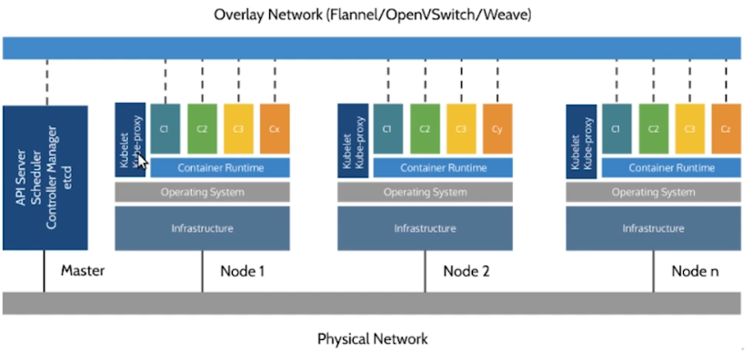
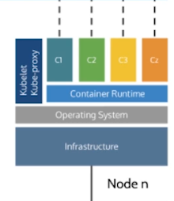

# Kubernetes

> Basado en el [curso de Platzi de Marcos Lilljedahl](https://platzi.com/cursos/k8s/) - VIDEO 3 COMPLETO.

Kubernetes es la plataforma de orquestación con mayor éxito en el mercado. Es una herramienta que por debajo utiliza Docker.


## Contenedores

Cotidianamente vamos a trabajar con dos entidades VMs y contenedores. La diferencia mas importante entre ambos es que los contenedores comparten un mismo sistema operativo.

Los contenedores no son un *first class citizen* del Kernel de Linux, es decir que no son entidades definidas sino un concepto abstracto formado por distintas tecnologías.

Está compuesto por 3 **tecnologías**.

* **Cgroups** (control groups) nos permiten aislar los recursos del sistema operativo tanto de memoria, IO (disco, red), CPU, etc. De esta manera si tengo un  procesador de 4GB y tengo dos contenedores y queremos que uno de ellos consuma 3GB y otro 1GB podremos hacerlo los cgroups serán los encargados de comunicarse con el kernel para tal fin.
* **Namespaces**. Nos permiten aislar el proceso de modo que viva en un sandbox de manera tal que no pueda acceder a otros recursos del sistema operativo de debajo o de otros contenedores. Existen varios tipos de namespaces. 
  * mount namespace: es el namespace encargado de que cada proceso tenga una visiblidad reducida de los directorios de trabajo, de manera tal que dos contenedores que trabajan sobre un sistema de archivos no interfieran entre sí, modificando archivos de otro.
  * networking namespace: es el namespace de red encargado de que cada contenedor tenga su stack de red (interfaz de red, dirección IP, tabla de rutas) y que no interfiera con otros contenedores.
  * pid namespace: es el namespace de procesos. 

* **Chroot**: Es la tecnología de Linux encargada de que en nuestro proceso tengamos visibilidad de los archivos que necesitamos y no podamos acceder a otros recursos del sistema. Tengamos presente que al empaquetar aplicaciones en contenedores estas vienen con dependencias o archivos necesarios para el correcto funcionamiento de la aplicación.


* Kubernetes utiliza un container runtime por debajo para orquestar todos sus servicios.

* Un **pod** es una entidad atómica scheduleable sobre la cual K8S va a ejecutar los contenedores.


## Pods

Kubernetes trabaja con una entidad de orquestación (scheduling) que se llama pod. 


### Docker & Kubernetes

Docker se encarga de *gestionar los contenedores*. Esto significa que opera sobre el ciclo de vida de un contenedor (correr, parar, establecer namespaces/cgroups quiero que corra con tanta memoria y tanto CPU).

Kubernetes se encarga del *workload placement*. Esto significa que dada una serie de contenedores que necesitan relacionarse entre sí  y dada una cierta cantidad de nodos del clúster que irá creciendo o decreciendo bajo demanda, gestionar cómo un contenedor o pod correrá en un nodo específico y otro en tal otro y a su vez se comuniquen entre sí. Este enfoque adquiere sentido ya que en la actualidad casi ya no existen aplicaciones monolíticas y siempre trabajaremos con microservicios. Luego vamos a orquestarla en un clúster de k8s para que escale atendiendo las demandas de los usuarios y también reducir costos con esta orquestación.

Kubernetes es una evolución de los proyectos de Google de proyectos como Borg & Omega que eran utilizados como orquestadores internos de sus servicios.

Docker nació como un proyecto Open Source de una empresa y Kubernetes también nació como un proyecto Open Source que además pertenece a la CNCF (Cloud Native Computing Foundation) formado por distintos desarrolladores y compañías que apoyan a esto pues son las bases del Cloud. Es por esto que los proveedores Cloud (Amazon, Azure, Digital Ocean) pueden ofrecer un manejador de Kubernetes. Gracias a esto no tendremos que instalar manualmente las máquinas virtuales en el Cloud ni los nodos.

Kubernetes es la plataforma más extensiva para la orquestación de servicios e infraestructura. Docker Swarm también es un orquestador pero tiene un enfoque más simple.


## Core Concepts

* Correr varias réplicas (replica set) asegurándonos de que todas estén en funcionamiento. Nuestra unidad de orquestación que es el pod, consistirá en varios contenedores en el mismo host y si necesito escalarlo (mayor cantidad de usuarios que usan la plataforma o un bottle neck quizás a raíz de una aplicación que no está del todo bien diseñada y consume muchos recursos de CPU y hasta tener un bug fix o un refactoring necesitamos que la app escale).

* Proveer un balanceador de cargas interno y externo. Esto significa que no tendré que preocuparme por instalar algo como http proxy o nginx para indicarle cómo quiero que sea dirigido el tráfico sino que al estar integrado con el Cloud Provider podré indicar desde k8s que quiero que los pods tengan un balanceador de cargas por encima.
* Definir mecanismos para hacer roll-outs de código. Nos permiten realizar rolling deployments con distintas estrategias como ser Blue-Green, Canary Deployment, etc.
* Definir políticas de scaling automáticas. Si la CPU de mi Pod > a cierto % quiero que mi pod escale (generar más réplicas pudiendo así satisfacer la demanda).
* Jobs batch. Como nuestros workloads no siempre son API o servicios long lived, en ocasiones debemos correr jobs o procesos que tienen un tiempo de vida definido. Por ejemplo si queremos que comience todos los días a tal hora, que tenga determinadas constraints como conectarse a cierto servicio no requiriendo más de tanta memoria o CPU. Esto nos permite correr estos jobs sin tener que hacerlo por fuera del orquestador.
* Correr servicio con datos stateful.
* CRDs, Service Catalog (saber lo que está desplegado y conectarme a ese), RBAC (Role-Based Access Control) le permite al orquestador dar políticas de roles. Si tengo diferentes equipos dentro de la organización puedo utilizar un cluster de k8s para darle acceso al equipo de Dev, QA, Analytics con un fine grain de quien puede acceder a cada recurso.


Un pod es la únidad atómica de orquetación que vive en un nodo y es un grupo de contenedores. 

> A diferencia de lo que ocurre en Docker Swarm, en Kubernetes podemos tener un pod de un único contenedor o de múltiples. En una aplicación muchas veces no tenemos una única pieza de código que hace una única funcionalidad sino que necesitamos de un side car que monitoree que todo esté bien o extrayendo datos para enviarlos a otro lado. 


Todos los contenedores que viven dentro de un pod comparten el mismo namespace de red (dirección IP) y se ven como procesos que están corriendo dentro del mismo sandbox.

Cuando necesitamos escalar el pod se crean copias del mismo (pensarlo como unidad atómica) y cuando se destruye deja de vivir (no se repetirá ese mismo id cuando creemos uno nuevo). 


## Arquitectura de Kubernetes

La arquitectura de Kubernetes está conformada por dos grandes partes: los nodos master (que controlan el estado) y lo nodos de trabajo (minions). 



Podemos interactuar con Kubernetes de dos maneras: a través de la API o mediante la interfaz de usuario ya sea el Kubernetes Dashboard o la línea de comandos kubctl (algunos lo llaman kube-control o kube-cuttle). Las UI se comunican con la API a través de métodos que pueden ser imperativos (por ejemplo kubectl run para correr un contenedor) o declarativos (que es a lo que apunta kubernetes donde le digo el estado deseado del cluster y entra en un ciclo de reconciliación constante hasta alcanzarlo).

Los nodos de trabajo son los que están registrados en nuestro cluster y están encargados de ejecutar nuestro trabajo. 

Cuando en un clúster un nodo master contamos con dos mecanismos que nos ayudarán a sobrellevarlo. En primer lugar Kubernetes se fundamenta en el algoritmo llamado *raft consensus*, *leader election* o consenso de arbitraje. Esto nos permite tener varios master redundantes en el clúster y cuando uno no responde, otro tomará el leadership del clúster y poder seguir ejecutando comandos. Otra opción sería levantarlo mediante un backup y volver a meterlo al clúster.

En caso de no haber nodo master no puedo enviarle comandos al cluster (crear servicios) pero el resto de la arquitectura va a seguir funcionando. 





## Nodo Master

* API Server
* Scheduler
* Controller Manager: están en un loop constante de reconciliación intentando alcanzar el estado deseado (en materia de réplicas, etc)
* etcd


## Nodos (Minions)

Están todos conectados a la misma red física y es aconsejable que tengan visibilidad.



* Container Runtime
* kubelet agente de kubernetes. monitorea los pods para saber si está vivo y se comunica con el API server.
* kube proxy es el componente del clúster que ante un paquete TCP/IP define a qué pod y contenedor debe ir.


# Declarativo vs Imperativo

Kubernetes hace énfasis en ser un sistema declarativo. 

Un sistema imperativo está compuesto por una serie de pasos que deben ser seguidos *a rajatabla*. Ante una interrupción o si el clúster se muere se debe comenzar devuelta pues no tengo el contexto.

```
kubctl run
kubctl deploy
```


En un sistema declarativo las tareas ante una interrupción es posible conocer dónde nos quedamos e intentar que converja al estado deseado. El objetivo es que sea observable y computable (actual vs deseado).

A partir de una especificación mediante un archivo .yaml indico el estado deseado.

Existe una metodología llamada GitOps que propone que versione todas estas especificaciones y luego las tome Kubernetes de manera automática.


VER VIDEO 4 Y 5 DEVUELTA Y COMPLETAR NOTAS.
