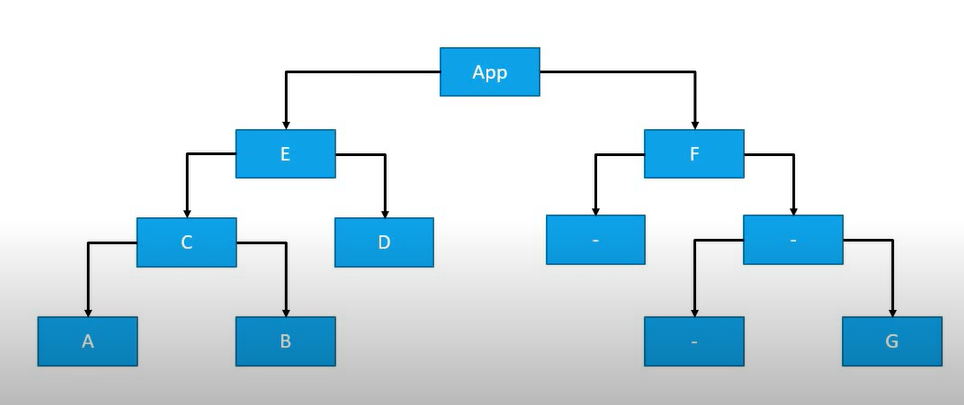

# React Redux
> Basado en lista de reproducción de [Codevolution](https://www.youtube.com/watch?v=9boMnm5X9ak&list=PLC3y8-rFHvwheJHvseC3I0HuYI2f46oAK&ab_channel=Codevolution). 
>
> Este curso fue dictado en 09/2019 por lo tanto se actualizaron algunos conceptos al 2023.

## ¿Qué es Redux?
Redux es una *state management library* pude ser definido como **un contenedor predecible del estado de aplicaciones JavaScript**.  

### Explicación

:duck: **contenedor de estado** porque almacena y maneja el estado de una aplicación. 

:duck: **predecible** porque los cambios de estado son explícitos y es posible hacer un seguimiento de ellos. 

:duck: **de aplicaciones JavaScript** porque puede ser utilizado con Vanilla JavaScript, React, Angular, Vue.

## Necesidad de Redux
Si bien los componentes de React ya tienen su propio estado, es posible que nos preguntemos por qué necesitamos una herramienta para ayudarnos a manejar el estado. Consideremos una aplicación con muchos componentes anidados donde tenemos el siguiente árbol:



* `App` tiene como hijos a `E` y `F`
* `E` tiene como hijos a `C` y `D`
* `C` tiene como hijos a `A` y `B`
Del otro lado de la rama `F` tiene componentes hijos anidados hasta llegar al componente `G`

## Sin Redux
Supongamos que `A` tiene un input para ingresar el nombre de usuario y lo almacena localmente en su estado. Si el componente hermano `B`  debe mostrar el nombre de usuario, tendremos que hacer la técnica de *lifting the state* siendo manejado en `C` proporcionando métodos y datos a los componentes `A` y `B`. 

De la misma manera si lo necesitáramos en el componente `D` deberíamos volver a tener que levantar el estado para que sea manejado por el componente `E`.

Si también necesitáramos mostrarlo en el componente `F` deberíamos repetir esta misma técnica una vez mas siendo manejado el estado por `App`

Por último si queremos mostrar el nombre de usuario en el componente `G` deberíamos pasarlo desde `App` por todo el árbol de componentes mediante props, con lo cual lo estarían recibiendo componentes que no tienen interés en esa información.

## Con Redux 
El estado es almacenado fuera de los componentes, si el componente `A` quiere modificar el estado se comunica con el *contenedor de estado Redux* este actualiza el estado de un modo predecible y le envía el valor sólo a aquellos componentes que lo necesitan.

:warning: Si bien podríamos pensar que esto podría haber sido solucionado utilizando **React Context** o los hooks `useContext` y `useReducer` debemos tener presente que Redux existe desde  Agosto de 2015 cuando los recursos mencionados no existían.

Resumiendo podemos decir que cuando estemos renegando bastante con el manejo del estado en nuestras aplicaciones, quizás sea el momento para utilizar Redux. 


# React Redux Package
React es una *UI library* y Redux es una *state management library* ambos trabajan de manera independiente. Usar Redux de manera directa en nuestra aplicación React es confuso y bastante difícil. En cambio contamos con **React-Redux** que es una biblioteca que nos ofrece funciones para hacer el binding entre React y Redux. 


# Conceptos Centrales

Los tres conceptos centrales de Redux son `Store`, `Action` y `Reducer`
* `Store`: contiene el **estado de la aplicación**.
* `Action`: describe los cambios en el estado de la aplicación.
* `Reducer`: ejecuta la transición de estado dependiendo del estado actual y de la `Action` recibida. Vincula `Store` con `Action`

> Si queremos hacer una analogía podemos pensar en una fábrica de tortas donde el `Store` es la bandeja donde se almacenan las tortas, `Action` es la intención de comprar una torta (reducir la cantidad total de tortas en una unidad) y `Reducer` es el vendedor que recibe la `Action` del cliente y toma la torta del armario y se la entrega. 


# Principios de Redux

El patrón de Redux se caracteriza por los siguientes principios:

1. El store es un objeto que contiene el estado de toda la aplicación. **La aplicación de JavaScript está suscripta (*subscribed*) a ese store**

> :cake: En el ejemplo de la fábrica de tortas si estuviéramos siguiendo el rastro de la cantidad de tortas disponibles, el estado de la aplicación sería: `{numOfCakes: 10}`

2. El estado es de sólo lectura y la única forma de cambiarlo es emitiendo (*dispatch*) una `Action`,  no está permitido modificar el objeto estado de manera directa. **La aplicación hace un dispatch de una action.**

> :cake: En el ejemplo de la fábrica de tortas le hacemos saber al vendedor que queremos comprar una torta: `{type: BUY_CAKE}`


3. Para especificar cómo el árbol de estado cambia con las acciones debemos escribir un `reducer` los cuales tendrán la forma `(previousState, action) => newState`. **El reducer de acuerdo a la acción recibida retorna el nuevo estado y lo actualiza. Como la aplicación está suscripta al Store recibe el nuevo valor. **
```js
const reducer = (state, action) => {
	switch(action.type){
		case BUY_BREAK:
			return {
				numOfCakes: state.numOfCakes - 1
			}
	}
}
```


# Stores

Para toda la aplicación tendremos un único store.

Tiene tres responsabilidades:
* **Contiene el estado** de toda la aplicación.

* Acceso mediante `getState()`.

* Actualización mediante `dispatch(action)`.

* Permite **suscribirse** y así registrar listeners mediante `subscribe(listener)` la función `listener` es ejecutada cada vez que los datos en el store cambian. También es posible **desuscribirse** llamando al a función que es retornada por `subscribe(listener)`

  

# Getting started

En primer lugar crearemos un proyecto de Node.js:

```
mkdir md-redux
cd md-redux
npm init -y
```

Comenzaremos trabajando con Redux con Vanilla JavaScript y cuando tengamos afianzados todos los conceptos fundamentales pasaremos a vincularlo con React. 

Si bien en la actualidad **Redux Toolkit es el modo oficial recomendado [en el repositorio oficial](https://github.com/reduxjs/redux) de escribir lógica Redux** en este curso se utiliza el core de redux a los fines didácticos y más adelante se incorporarán los conceptos de RTK.

```
npm install @reduxjs/toolkit
```


Luego creamos un archivo `index.js`.

```
touch index.js
```

Luego lo ejecutamos:

```
node index
```


:golf: Creamos una archivo `.gitignore` con contenido específico relacionado con Node

```
npx gitignore node
```

De esta manera nos aseguramos no incluir en el repositorio directorios de dependencias como `node_modules/`, variables de entorno en `.env`, `.env.local`, etc.


## Primeros Pasos

A la hora de comenzar a trabajar con Redux podemos importarlo como un CommonJS Module:

```js
const redux = require('redux')
```

Sin embargo optamos por la opción de utilizar ES Modules pero para eso antes tendremos que modificar el `package.json` agregando:

```json
"type":"module",
```

```js
import { createStore } from 'redux';
```


A continuación mostramos un ejemplo completo de un reducir que procesa una única acción:

```js
import { createStore } from 'redux';

const BUY_CAKE = 'BUY_CAKE';

const initialState = {
	numOfCakes: 10,
};

function buyCake() {
	return {
		type: BUY_CAKE,
		info: 'First redux action',
	};
}

const reducer = (state = initialState, action) => {
	switch (action.type) {
		case BUY_CAKE:
			return { ...state, numOfCakes: state.numOfCakes - 1 };
		default:
			return state;
	}
};

const store = createStore(reducer);

console.log('Initial State', store.getState());

const unsubscribe = store.subscribe(() => console.log('Updated state', store.getState()));

store.dispatch(buyCake());
store.dispatch(buyCake());
store.dispatch(buyCake());

unsubscribe();
```


## Explicación

En el código anterior lo que hacemos es crear un store con un determinado estado inicial y luego despachar acciones utilizando como argumento action creators. Luego el `reducer`  de acuerdo a la acción recibida modificará el estado.

Vamos a mostrar el estado inicial con la siguiente línea de código:

```
console.log('Initial State', store.getState());
```

Luego en la medida que despachamos acciones también mostramos el estado actualizado pues nos suscribimos a ese store:

```jsx
const unsubscribe = store.subscribe(() => console.log('Updated state', store.getState()));

store.dispatch(buyCake());
store.dispatch(buyCake());
store.dispatch(buyCake());

unsubscribe();
```

Las **acciones** son el único modo de interactuar con el store y son objetos JavaScript que deben tener la propiedad `type` (normalmente es un string) indicando la acción a realizar.

En cuanto al **dispatch** de la acción si bien podríamos poner directamente la acción esto ocasionaría que luego en caso de querer cambiarla agregando una propiedad por ejemplo tengamos que modificar en todos los lados donde la usamos, en cambio con el **action creator** modificaríamos en un único lugar. Usamos `store.dispatch(buyCake())` y como queremos causar más transiciones de estado copiamos la misma línea tres veces.

En lugar de utilizar directo un string definimos una constante con el `type` de la acción: `const BUY_CAKE= 'BUY_CAKE';` para evitar errores de tipeo.

Para desuscribirnos del `store` debemos llamar la función `unsuscribe()`

Al ejecutar `node index` veremos :

```
Initial State { numOfCakes: 10 }
Updated state { numOfCakes: 9 }
Updated state { numOfCakes: 8 }
Updated state { numOfCakes: 7 }
```

En cuanto al **reducer** como en situaciones reales el `state` contendrá más de una propiedad por lo que debemos realizar una copia antes del mismo y luego sólo cambiar las propiedades que debemos cambiar. Lo cual hacemos con el *spread operator*:


## Múltiples Reducers

Suponiendo ahora que el negocio marcha bien y decidimos además vender helados. Por una cuestión de escalabilidad consideramos que tendremos el empleado 1 encargado de vender tortas y el empleado 2 encargado de vender helados. De esta manera en caso de una nueva diversificación será más fácil de implementar y más fácil de detectar los posibles errores. Esto en términos de código se reduce en tener múltiples reducers.

### Reducer Único
Implementando esto primero con un único reducer:
```js
const redux = require('redux');

const createStore = redux.createStore;

const BUY_CAKE = 'BUY_CAKE';
const BUY_ICECREAM = 'BUY_ICECREAM';

function buyCake() {
	return {
		type: BUY_CAKE,
		info: 'First redux action',
	};
}
function buyIceCream() {
	return {
		type: BUY_ICECREAM,
	};
}

// (previousState, action) => newState

const initialState = {
	numOfCakes: 10,
	numOfIceCreams: 20,
};

const reducer = (state = initialState, action) => {
	switch (action.type) {
		case BUY_CAKE:
			return { ...state, numOfCakes: state.numOfCakes - 1 };
		case BUY_ICECREAM:
			return { ...state, numOfIceCreams: state.numOfIceCreams - 1 };
		default:
			return state;
	}
};

const store = createStore(reducer);

console.log('Initial State', store.getState());

const unsubscribe = store.subscribe(() => console.log('Updated state', store.getState()));

store.dispatch(buyCake());
store.dispatch(buyCake());
store.dispatch(buyCake());
store.dispatch(buyIceCream());
store.dispatch(buyIceCream());

unsubscribe();
```

Si bien esta implementación con un único reducer funciona, cuando la aplicación crece tendremos una función muy grande y dificil de debuggear.

```
Initial State { numOfCakes: 10, numOfIceCreams: 20 }
Updated state { numOfCakes: 9, numOfIceCreams: 20 }
Updated state { numOfCakes: 8, numOfIceCreams: 20 }
Updated state { numOfCakes: 7, numOfIceCreams: 20 }
Updated state { numOfCakes: 7, numOfIceCreams: 19 }
```

### Múltiples reducers con `combineReducers`
Haremos uso de una función `combineReducers` para combinar múltiples reducers  y por convención llamamos `rootReducer` a dicha combinación.

```js
import { createStore, combineReducers } from "redux";

const BUY_CAKE = 'BUY_CAKE';
const BUY_ICECREAM = 'BUY_ICECREAM';

function buyCake() {
	return {
		type: BUY_CAKE,
	};
}
function buyIceCream() {
	return {
		type: BUY_ICECREAM,
	};
}

const initialCakeState = {
	numOfCakes: 10,
};
const initialIceCreamState = {
	numOfIceCreams: 20,
};

const cakeReducer = (state = initialCakeState, action) => {
	switch (action.type) {
		case BUY_CAKE:
			return { ...state, numOfCakes: state.numOfCakes - 1 };
		default:
			return state;
	}
};
const iceCreamReducer = (state = initialIceCreamState, action) => {
	switch (action.type) {
		case BUY_ICECREAM:
			return { ...state, numOfIceCreams: state.numOfIceCreams - 1 };
		default:
			return state;
	}
};

const rootReducer = combineReducers({
	cake: cakeReducer,
	iceCream: iceCreamReducer,
});

const store = createStore(rootReducer);

console.log('Initial State', store.getState());

const unsubscribe = store.subscribe(() => console.log('Updated state', store.getState()));

store.dispatch(buyCake());
store.dispatch(buyCake());
store.dispatch(buyCake());
store.dispatch(buyIceCream());
store.dispatch(buyIceCream());

unsubscribe();
```

Ahora obtenemos en pantalla:
```js
Initial State { cake: { numOfCakes: 10 }, iceCream: { numOfIceCreams: 20 } }
Updated state { cake: { numOfCakes: 9 }, iceCream: { numOfIceCreams: 20 } }
Updated state { cake: { numOfCakes: 8 }, iceCream: { numOfIceCreams: 20 } }
Updated state { cake: { numOfCakes: 7 }, iceCream: { numOfIceCreams: 20 } }
Updated state { cake: { numOfCakes: 7 }, iceCream: { numOfIceCreams: 19 } }
Updated state { cake: { numOfCakes: 7 }, iceCream: { numOfIceCreams: 18 } }
```

Cuando hacemos un dispatch de una action la reciben los dos reducers y uno de ellos actuará en consecuencia y el otro la ignorará.

Esta implementación nos permite que cada reducer maneje su parte del estado. Cuando la aplicación crece en tamaño podríamos colocarlos en distintos archivos.

 


# Middleware
Es el modo sugerido para extender Redux con funcionalidades personalizadas. 
> El concepto es similar al visto al estudiar Express.js donde el middleware consiste en una función que es llamada entre el llamado a dos funciones.

Se trata de una forma de realizar una tarea entre el momento del *dispatch* de una `Action` y el momento en que llega al `Reducer`. Podemos utilizar middleware para loguear, reporte de crasheos, tareas asincrónicas, etc.

## `redux-logger`

Utilizaremos el middleware `redux-logger` que básicamente se encarga de loguear toda la información relacionada con Redux en la aplicación.

```bash
npm i redux-logger
```


```js
import { applyMiddleware, createStore } from 'redux';
import { createLogger } from 'redux-logger'

(...)

const store = createStore(rootReducer, applyMiddleware(logger));
```

```js
import { applyMiddleware, createStore } from 'redux';
import { createLogger } from 'redux-logger'

const logger = createLogger({
  // ...options
});

const BUY_CAKE = 'BUY_CAKE';
const BUY_ICECREAM = 'BUY_ICECREAM';

function buyCake() {
	return {
		type: BUY_CAKE,
	};
}
function buyIceCream() {
	return {
		type: BUY_ICECREAM,
	};
}

// (previousState, action) => newState

const initialCakeState = {
	numOfCakes: 10,
};
const initialIceCreamState = {
	numOfIceCreams: 20,
};

const cakeReducer = (state = initialCakeState, action) => {
	switch (action.type) {
		case BUY_CAKE:
			return { ...state, numOfCakes: state.numOfCakes - 1 };
		default:
			return state;
	}
};
const iceCreamReducer = (state = initialIceCreamState, action) => {
	switch (action.type) {
		case BUY_ICECREAM:
			return { ...state, numOfIceCreams: state.numOfIceCreams - 1 };
		default:
			return state;
	}
};

const rootReducer = combineReducers({
	cake: cakeReducer,
	iceCream: iceCreamReducer,
});
const store = createStore(rootReducer, applyMiddleware(logger));

console.log('Initial State', store.getState());

const unsubscribe = store.subscribe(() => console.log('Updated state', store.getState()));

store.dispatch(buyCake());
store.dispatch(buyCake());
store.dispatch(buyCake());
store.dispatch(buyIceCream());
store.dispatch(buyIceCream());

unsubscribe();
```
En pantalla veremos:

```js
Initial State { cake: { numOfCakes: 10 }, iceCream: { numOfIceCreams: 20 } }
Updated state { cake: { numOfCakes: 9 }, iceCream: { numOfIceCreams: 20 } }
 action BUY_CAKE @ 19:31:14.667
   prev state { cake: { numOfCakes: 10 }, iceCream: { numOfIceCreams: 20 } }
   action     { type: 'BUY_CAKE' }
   next state { cake: { numOfCakes: 9 }, iceCream: { numOfIceCreams: 20 } }
Updated state { cake: { numOfCakes: 8 }, iceCream: { numOfIceCreams: 20 } }
 action BUY_CAKE @ 19:31:14.672
   prev state { cake: { numOfCakes: 9 }, iceCream: { numOfIceCreams: 20 } }
   action     { type: 'BUY_CAKE' }
   next state { cake: { numOfCakes: 8 }, iceCream: { numOfIceCreams: 20 } }
Updated state { cake: { numOfCakes: 7 }, iceCream: { numOfIceCreams: 20 } }
 action BUY_CAKE @ 19:31:14.677
   prev state { cake: { numOfCakes: 8 }, iceCream: { numOfIceCreams: 20 } }
   action     { type: 'BUY_CAKE' }
   next state { cake: { numOfCakes: 7 }, iceCream: { numOfIceCreams: 20 } }
Updated state { cake: { numOfCakes: 7 }, iceCream: { numOfIceCreams: 19 } }
 action BUY_ICECREAM @ 19:31:14.682
   prev state { cake: { numOfCakes: 7 }, iceCream: { numOfIceCreams: 20 } }
   action     { type: 'BUY_ICECREAM' }
   next state { cake: { numOfCakes: 7 }, iceCream: { numOfIceCreams: 19 } }
Updated state { cake: { numOfCakes: 7 }, iceCream: { numOfIceCreams: 18 } }
 action BUY_ICECREAM @ 19:31:14.688
   prev state { cake: { numOfCakes: 7 }, iceCream: { numOfIceCreams: 19 } }
   action     { type: 'BUY_ICECREAM' }
   next state { cake: { numOfCakes: 7 }, iceCream: { numOfIceCreams: 18 } }
```

# Async Actions
Hasta el momento trabajamos con actions sincrónicas dado que en el momento en que se producía el dispatch el state era actualizado de manera inmediata. 

Sin embargo en ocasiones vamos a querer hacer llamadas asincrónicas a una API para obtener datos de un endpoint.

El propósito será realizar un fetch de una lista de usuarios de una endpoint de una API y guardarlos en redux store.


## State
Tendrá la siguiente forma:
```js
state = {
	loading: true, //con el propósito de mostrar un loading spinner
	users: [], //lista de usuarios inicialmente un array vacío
	error: '' //error para mostrarle al usuario
}
```

## Actions
Tendremos tres actions:
* `FETCH_USERS_REQUEST` fetch lista de usuarios
Las otras son dependientes de esta primera action.
* `FETCH_USERS_SUCCESS` fetch exitoso.
* `FETCH_USERS_FAILURE` fetch con error.

## Reducers
case FETCH_USERS_REQUEST:
	loading: true
	
case FETCH_USERS_SUCCESS
	loading: false
	users: data from API
	
case FETCH_USERS_FAILURE
	loading: false
	error: error from API

Creamos `asyncActions.js`
```js
const redux = require('redux');
const createStore = redux.createStore;

const initialState = {
	loading: false,
	users: [],
	error: '',
};

const FETCH_USERS_REQUEST = 'FETCH_USERS_REQUEST';
const FETCH_USERS_SUCCESS = 'FETCH_USERS_SUCCESS';
const FETCH_USERS_FAILURE = 'FETCH_USERS_FAILURE';

const fetchUsersRequest = () => {
	return {
		type: FETCH_USERS_REQUEST,
	};
};

const fetchUsersSuccess = users => {
	return {
		type: FETCH_USERS_SUCCESS,
		payload: users,
	};
};

const fetchUsersFailure = error => {
	return {
		type: FETCH_USERS_FAILURE,
		payload: error,
	};
};

const reducer = (state = initialState, action) => {
	switch (action.type) {
		case FETCH_USERS_REQUEST:
			return {
				...state,
				loading: true,
			};
		case FETCH_USERS_SUCCESS:
			return {
				loading: false,
				users: action.payload,
				error: '',
			};
		case FETCH_USERS_FAILURE:
			return {
				loading: false,
				users: [],
				error: action.payload,
			};
	}
};

const store = createStore(reducer);
```

Veremos ahora cómo usar action creators con network requests, es decir cómo hacer una llamada a una APi usando Redux.

Debemos instalar dos paquetes **axios** (para realizar requests a un endpoint de la API) y **redux-thunk** (nos permitirá definir action creators asincrónicos). Básicamente `redux-thunk` se trata de un middleware.

`npm i axios redux-thunk`

```js
const redux = require('redux');
const createStore = redux.createStore;
const applyMiddleware = redux.applyMiddleware;
const thunkMiddleware = require('redux-thunk').default;
const axios = require('axios');

const initialState = {
	loading: false,
	users: [],
	error: '',
};

const FETCH_USERS_REQUEST = 'FETCH_USERS_REQUEST';
const FETCH_USERS_SUCCESS = 'FETCH_USERS_SUCCESS';
const FETCH_USERS_FAILURE = 'FETCH_USERS_FAILURE';

const fetchUsersRequest = () => {
	return {
		type: FETCH_USERS_REQUEST,
	};
};

const fetchUsersSuccess = users => {
	return {
		type: FETCH_USERS_SUCCESS,
		payload: users,
	};
};

const fetchUsersFailure = error => {
	return {
		type: FETCH_USERS_FAILURE,
		payload: error,
	};
};

const reducer = (state = initialState, action) => {
	switch (action.type) {
		case FETCH_USERS_REQUEST:
			return {
				...state,
				loading: true,
			};
		case FETCH_USERS_SUCCESS:
			return {
				loading: false,
				users: action.payload,
				error: '',
			};
		case FETCH_USERS_FAILURE:
			return {
				loading: false,
				users: [],
				error: action.payload,
			};
	}
};

//Utilizando un thunk-middleware tenemos la capacidad de retornar una función en lugar de un objeto. Esta función no tiene que ser pura y puede tener side effects como ser el llamado a una API y también es capaz de hacer dispatch de actions.
const fetchUsers = () => {
	return function (dispatch) {
		dispatch(fetchUsersRequest());
		axios
			.get('https://jsonplaceholder.typicode.com/users')
			.then(response => {
				const users = response.data.map(user => user.id);
				dispatch(fetchUsersSuccess(users));
			})
			.catch(error => {
				dispatch(fetchUsersFailure(error.message));
			});
	};
};

const store = createStore(reducer, applyMiddleware(thunkMiddleware));
store.subscribe(() => {
	console.log(store.getState());
});
store.dispatch(fetchUsers());

```

Por simplicidad hacemos un mapeo para solo almacenar los id  de los usuarios.

En primer lugar al ejecutar el código veremos el estado de `loading: true` y luego el estado donde se han obtenido los datos de usuario.

```json
{ loading: true, users: [], error: '' }
  loading: false,
  users: [
    1, 2, 3, 4,  5,
    6, 7, 8, 9, 10
  ],
  error: ''
}
```
En cambio para probar el comportamiento ante un error vamos generar un error cambiamos la URL a una URL inválida.
```json
{ loading: true, users: [], error: '' }
{
  loading: false,
  users: [],
  error: 'getaddrinfo ENOTFOUND ysonplaceholder.typicode.com'
}
```

Este modo de trabajo será utilizado al ahora de hacer *data fetching* al trabajar con React Redux

