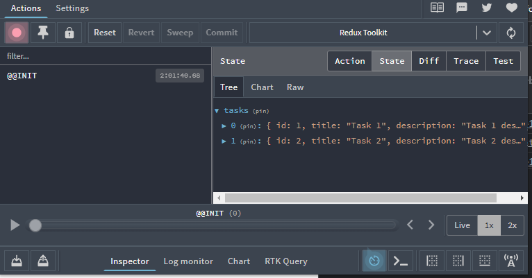
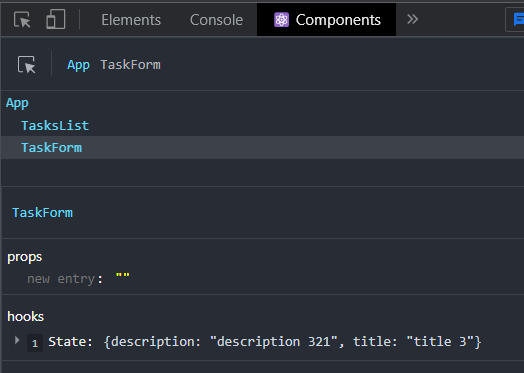
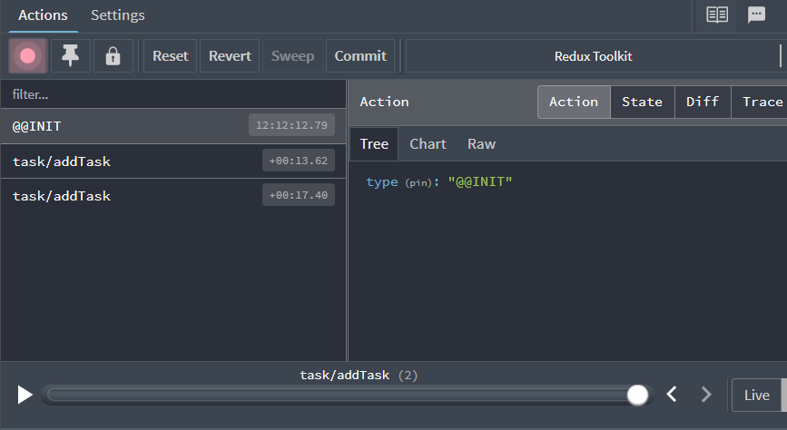

# Redux Toolkit

* :pencil: Basado en el [video](https://youtu.be/w2rAP7d6ndg) de Fazt Code (COMPLETO)


## Getting Started

### Instalación Vite.js

:warning: Si bien en el material de estudio utilizan Create React App, vamos a utilizar Vite.js para hacer el scaffolding del proyecto por simplicidad.

```
npm create vite@latest
```


# Inicio Aplicación

La idea es crear una simple TODO List utilizando Redux Toolkit y 

Como podemos ver en la [documentación](https://redux-toolkit.js.org/introduction/getting-started) Redux Toolkit es el modo aconsejado actualmente de escribir lógica Redux. Fue desarrollado para solucionar algunos aspectos asociados a usar simplemente el core de Redux (configuración complicada, mucho boilerplate, muchos paquetes).

Nos vamos a guiar con el aparado [Quick Start](https://redux-toolkit.js.org/tutorials/quick-start) que nos indica qué debemos instalar y qué archivos debemos crear inicialmente.


## Instalación

```
npm install @reduxjs/toolkit react-redux
```


## Extensión Redux DevTools

Se recomienda instalar en Chrome la extensión [Redux DevTools](https://chrome.google.com/webstore/detail/redux-devtools/lmhkpmbekcpmknklioeibfkpmmfibljd?hl=en) que podremos lanzar con `Control+Shift+E`

## Creación de store

Creamos un archivo llamado `src/app/store.js` donde importamos `configureStore` de :sparkles: **Redux Toolkit** :sparkles: en el cual crearemos un store y lo exportamos.

```jsx
import { configureStore } from '@reduxjs/toolkit'

export const store = configureStore({
  reducer: {}
})
```


## Provide del store a React

Una vez que creamos el store lo disponibilizamos para React mediante el `<Provider>` de :sparkles: **React-Redux** :sparkles: en `src/main.js`

```jsx
import React from 'react'
import ReactDOM from 'react-dom/client'
import App from './App'

import {store} from './app/store'
import { Provider } from 'react-redux'

ReactDOM.createRoot(document.getElementById('root')).render(
  <React.StrictMode>
    <Provider store={store}>
      <App />
      </Provider>
  </React.StrictMode>,
)
```


## Creamos un State Slice

En el patrón redux es a través de los reducers que vamos a alterar el estado y en Redux RTK lo haremos mediante slices.

Como se trata de una aplicación de una lista de tareas creamos el siguiente archivo `src/features/task/tasksSlice.`

En primer lugar importamos `createSlice` de :sparkles: **Redux Toolkit** :sparkles: 

```jsx
import { createSlice } from '@reduxjs/toolkit'

export const tasksSlice = createSlice({
  name: 'tasks',
  initialState: [],
  reducers: {
    
  },
})

export default tasksSlice.reducer
```

Dentro del objeto `reducers` es dónde le diremos qué es lo que queremos hacer `addTask`, `deleteTask`, etc y luego exportaremos estas acciones.

Notar que `createSlice` nos devuelve un objeto y estamos exportando ese objeto y también como default `tasksSlice.reducer`.


## Agregar slice reducers al store

En `store.js` asociamos el slice reducer al store. Al definir un campo dentro del parámetro `reducer` le estamos indicando que debe usar ese slice reducer para todas las actualizaciones de ese estado.

```jsx
import { configureStore } from '@reduxjs/toolkit'
import tasksReducer from '../features/tasks/tasksSlice'

export const store = configureStore({
  reducer: {
    tasks: tasksReducer
  }
})
```


## Lectura del estado en componentes

Para lograr que los componentes de React interactúen con el store utilizamos los hooks de React-Redux. En primer lugar usaremos `useSelector` que nos permite leer datos del store.


En `App.js`  vamos a obtener el estado del store y a mostrarlo en pantalla:

```jsx
import { useSelector } from "react-redux"

function App() {
  const tasks = useSelector(state => state.tasks);
  console.log(tasks)
  return (
    <div>
      <h1>Redux Toolkit</h1>
    </div>
  )
}

export default App
```


## Store con valor inicial

Hasta ahora consideramos que el valor inicial del store sería un array vacío, ahora trabajaremos con un array de objetos.

```jsx
import { createSlice } from '@reduxjs/toolkit'

const initialState = [
  {
    id: "1",
    title: "Task 1", 
    description: "Task 1 description",
    completed: false
  }, 
  {
    id: "2",
    title: "Task 2", 
    description: "Task 2 description",
    completed: false
  }
]

export const tasksSlice = createSlice({
  name: 'task',
  initialState,
  reducers: {
    
  },
})

export default tasksSlice.reducer
```

El id que utilizamos es un string por dos motivos:

1. Utilizaremos la [biblioteca uuid](https://www.npmjs.com/package/uuid) para generar ids únicos que serán de tipo string.
2. Utilizaremos parámetros en las urls a la hora de editar tareas que también son strings.

## Nuevos componetes

Vamos a crear una carpeta `src/components` dentro de la cual tendremos dos componentes uno llamado `TaskList.jsx` y otro `TaskForm.jsx` y los importamos en `App.jsx` de la forma habitual.

## Listado de Tareas

Creamos un componente `src/components/TasksList.jsx` en el que por el momento sólo mostraremos los elementos del valor inicial:

```jsx
import React from 'react'
import {useSelector} from 'react-redux'

function TasksList() {
  const tasks = useSelector(state => state.tasks)

  return (
    <>
      {tasks.map(task => (
        <div key={task.id}>
          <p>{task.title}</p>
          <p>{task.description}</p>
        </div>
      ))}
    </>
  )
}

export default TasksList
```

Con las Redux DevTools podremos ver lo siguiente:




# Creación de Tareas

Creamos el componente `src/components/TaskForm.jsx` que contendrá un formulario simple con un un input de texto y un textarea en los cuales tendremos que ingresar el título y la descripción de la nueva tarea. Al presionar el botón Save por el momento se mostrará la variable de estado en pantalla. 

```jsx
import React, { useState } from 'react'

function TaskForm() {
  const [task, setTask] = useState({
    title: '',
    description:'',
    completed: false
  })
  const handleChange = e => {
    setTask({...task, [e.target.name]:e.target.value})
  }

  const handleSubmit = (e) => {
    e.preventDefault();
    console.log(task)
  }

  return (
    <form onSubmit={handleSubmit}>
      <input type='text' name='title' placeholder='title' onChange={handleChange}/>
      <textarea name='description' placeholder='description' onChange={handleChange}/>
      <button>Save</button>
    </form>
  )
}

export default TaskForm

```

En las React DevTools podremos ver el valor que va tomando el estado en cada momento sin la necesidad de loguear en pantalla:




## Modificación Slice

Como en última instancia lo que queremos hacer es agregar este elemento al store, debemos modificar `tasksSlice` de manera tal que podamos agregar tareas.

Esto lo hacemos en dos pasos primero creando un reducer `addTask` y luego exportándolo desde `taskSlice.actions`.

```jsx
import { createSlice } from '@reduxjs/toolkit'

const initialState = [
  {
    id: "1",
    title: "Task 1", 
    description: "Task 1 description",
    completed: false
  }, 
  {
    id: "2",
    title: "Task 2", 
    description: "Task 2 description",
    completed: false
  }
]

export const taskSlice = createSlice({
  name: 'task',
  initialState,
  reducers: {
    addTask: (state, action) => {
      console.log(state,action)
    }
  },
})

export const { addTask } = taskSlice.actions;
export default taskSlice.reducer;
```

Luego en `TaskForm` importamos el hook `useDispatcher`  y también la acción `addTask`. Luego al hacer submit del formulario ejecutamos `dispatch(addTask(task))`

```jsx
import React, { useState } from 'react'
import { useDispatch } from 'react-redux'
import { addTask } from '../features/tasks/taskSlice'

function TaskForm() {
  const [task, setTask] = useState({
    title: '',
    description:'',
    completed: false
  })
  const dispatch = useDispatch()

  const handleChange = e => {
    setTask({...task, [e.target.name]:e.target.value})
  }

  const handleSubmit = (e) => {
    e.preventDefault();
    // console.log(task)
    dispatch(addTask(task))
  }

  return (
    <form onSubmit={handleSubmit}>
      <input type='text' name='title' placeholder='title' onChange={handleChange}/>
      <textarea name='description' placeholder='description' onChange={handleChange}/>
      <button>Save</button>
    </form>
  )
}

export default TaskForm

```


Recordemos que en  `TaskSlice` tenemos un `console.log(state,action)` por lo que en pantalla veremos:

```jsx
Proxy {0: {…}} 
{
type: 'task/addTask', 
payload: 
{title: 'Task 3 ', description: 'Task 3 description'}}
```

Esto significa que el valor que le estamos pasando lo recibimos como `action.payload`


De la misma manera en las Redux DevTools podremos ver estas acciones:




## Generación de id único

Por el momento la tarea no tiene id por lo tanto obtendremos un warning indicando que debemos tener un `key` distinto en los elementos y tampoco tiene el campo `completed`.

```
npm i uuid
```

En `TaskForm` vamos a importar esta biblioteca y a la hora de crear una nueva tarea le asignamos un id único.


Queremos ahora modificar `taskSlice` de manera que el nuevo elemento sea agregado al store.

```jsx
import { createSlice } from '@reduxjs/toolkit'

const initialState = [
  {
    id: "1",
    title: "Task 1", 
    description: "Task 1 description",
    completed: false
  }, 
  {
    id: "2",
    title: "Task 2", 
    description: "Task 2 description",
    completed: false
  }
]

export const taskSlice = createSlice({
  name: 'task',
  initialState,
  reducers: {
    addTask: (state, action) => {
      state.push(action.payload)
    }
  },
})

export const { addTask } = taskSlice.actions;
export default taskSlice.reducer;
```


## :rotating_light: Importante

Redux Toolkit nos permite escribir lógica "mutante" en los reducers como vemos con `state.push(action.payload)`. En realidad no está mutando el estado realmente porque usa la biblioteca Immer que detecta esos cambios y produce un nuevo estado inmutable basado en esos cambios.


# Borrado de tarea

En `TaskList` debemos agregar un botón asociado a cada tarea de modo que al presionarlo elimine la tarea del store.


Luego debemos modificar `taskSlice`

```jsx
import { createSlice } from '@reduxjs/toolkit'

const initialState = [
  {
    id: "1",
    title: "Task 1", 
    description: "Task 1 description",
    completed: false
  }, 
  {
    id: "2",
    title: "Task 2", 
    description: "Task 2 description",
    completed: false
  }
]

export const taskSlice = createSlice({
  name: 'task',
  initialState,
  reducers: {
    addTask: (state, action) => {
      state.push(action.payload)
    },
    deleteTask: (state, action) => {
      const taskFound = state.find(task => task.id === action.payload);
      if (taskFound) {
        state.splice(state.indexOf(taskFound),1)
      }
    }
  },
})

export const { addTask, deleteTask } = taskSlice.actions;
export default taskSlice.reducer;
```

:rotating_light: Notar nuevamente que utilizamos lógica "mutante" con `state.splice(state.indexOf(taskFound),1)` pero en realidad no estamos mutando el estado.


# Edición de tareas

### Router 

Queremos que sea posible editar una tarea en una página aparte y para eso haremos uso de React Router DOM.

```
npm install react-router-dom@6
```


Lo primero que hacemos es modificar `App` de manera tal que si el usuario está navegando en `/` le muestro `TaskList` y si está en `/create` le muestro `TaskForm`.

```jsx
import {useSelector} from 'react-redux'
import TaskForm from './components/TaskForm'
import TasksList from './components/TasksList'
import {BrowserRouter, Routes, Route} from 'react-router-dom'
import Error from './components/Error'

function App() {
  return (
    <div>
      <BrowserRouter>
        <Routes>
          <Route path="/" element={<TasksList/>} />
          <Route path="/create-task" element={<TaskForm />} />
          <Route path="*" element={<Error/>}/>
        </Routes>
      </BrowserRouter>
    </div>
  )
}

export default App
```

También creamos una página de Error que será mostrada cuando la url ingresada no corresponda con ninguna de las establecidas.


### Navegación

Además queremos que la guardar una nueva tarea nos redireccione a /. Esto lo hacemos con el hook `useNavigate` de :sparkles: React Router :sparkles:.

Por lo tanto en `Task-Form` lo usamos como `const navigate = useNavigate()` y luego al guardar una tarea llamamos a `navigate('/')`

```jsx
import React, {useState} from 'react'
import {useDispatch} from 'react-redux'
import {addTask} from '../features/tasks/taskSlice'
import {v4 as uuidv4} from 'uuid'
import {useNavigate} from 'react-router-dom'

function TaskForm() {
  const [task, setTask] = useState({
    title: '',
    description: '',
    completed: false,
  })
  const dispatch = useDispatch()
  const navigate = useNavigate()

  const handleChange = e => {
    setTask({...task, [e.target.name]: e.target.value})
  }

  const handleSubmit = e => {
    e.preventDefault()
    // console.log(task)
    dispatch(addTask({ ...task, id: uuidv4() }))
    navigate('/')
  }

  return (
    <form onSubmit={handleSubmit}>
      <input type='text' name='title' placeholder='title' onChange={handleChange} />
      <textarea name='description' placeholder='description' onChange={handleChange} />
      <button>Save</button>
    </form>
  )
}

export default TaskForm
```

### Navbar

Creamos un componente `Navbar` con la finalidad de que nos permita navegar de una sección a la otra.

```jsx
import {useSelector} from 'react-redux'
import TaskForm from './components/TaskForm'
import TasksList from './components/TasksList'
import {BrowserRouter, Routes, Route} from 'react-router-dom'
import Navbar from './components/Navbar'
import Error from './components/Error'

function App() {
  return (
    <div>
      <BrowserRouter>
        <Navbar/>
        <Routes>
          <Route path="/" element={<TasksList/>} />
          <Route path="/create-task" element={<TaskForm />} />
          <Route path="*" element={<Error/>}/>
        </Routes>
      </BrowserRouter>
    </div>
  )
}

export default App
```


### Navegación a página de edición

En `TaskList` debemos agregar un modo de editar cada una de las tareas y lo haremos haciendo uso de `Link` de modo que tendremos:

```jsx
<Link to={`/edit-task/${task.id}`}>Editar</Link>
```


`TaskList` completo nos quedará:

```jsx
import React from 'react'
import {useDispatch, useSelector} from 'react-redux'
import { Link } from 'react-router-dom'
import { deleteTask } from '../features/tasks/taskSlice'

function TasksList() {
  const tasks = useSelector(state => state.tasks)
  const dispatch = useDispatch()

  const handleDelete = (id) => {
    dispatch(deleteTask(id))
  }

  return (
    <>
      {tasks.map(task => (
        <div key={task.id}>
          <p>{task.title}</p>
          <p>{task.description}</p>
          <button onClick={() => handleDelete(task.id)}>Delete</button>
          <Link to={`/edit-task/${task.id}`}>Editar</Link>
        </div>
      ))}
    </>
  )
}

export default TasksList
```


### Ruteo de tarea a editar

Debemos ahora modificar `App` de modo que al ingresar a una url como `/edit-task/1` sepa que se trata de un **id** y renderice el componente `TaskForm` (luego veremos cómo completar los )


:high_brightness: 

```jsx
<Route path="/edit-task/:id" element={<TaskForm />}/>
```


```jsx
import {useSelector} from 'react-redux'
import TaskForm from './components/TaskForm'
import TasksList from './components/TasksList'
import {BrowserRouter, Routes, Route} from 'react-router-dom'
import Navbar from './components/Navbar'
import Error from './components/Error'

function App() {
  return (
    <div>
      <BrowserRouter>
        <Navbar/>
        <Routes>
          <Route path="/" element={<TasksList/>} />
          <Route path="/create-task" element={<TaskForm />} />
          <Route path="/edit-task/:id" element={<TaskForm />}/>
          <Route path="*" element={<Error/>}/>
        </Routes>
      </BrowserRouter>
    </div>
  )
}

export default App
```


### Cargar datos de tarea

`TaskForm` lo usamos entonces para crear notas nuevas y para editar existentes. Hacemos uso del hook `useParams` para obtener el `id` de la tarea que estamos editando:

```
const {id} = useParams()
```

Como queremos obtener la tarea cuyo `id` recibimos como parámetro utilizamos un `useEffect` que apenas carga el componente obtiene esa tarea del store y carga el formulario con esa info.

Además guardar si estamos en creación o edición tendremos que despachar acciones distintas cosa que también hacemos de acuerdo a la presencia o no de id.

`TaskForm` nos queda (despachando la acción `editTask` que todavía no hemos creado).

```jsx
import React, {useEffect, useState} from 'react'
import {useDispatch, useSelector} from 'react-redux'
import {addTask, editTask} from '../features/tasks/taskSlice'
import {v4 as uuidv4} from 'uuid'
import {useNavigate, useParams} from 'react-router-dom'

function TaskForm() {
  const [task, setTask] = useState({
    title: '',
    description: '',
    completed: false,
  })
  const dispatch = useDispatch()
  const navigate = useNavigate()
  const params = useParams()
  const tasks = useSelector(state => state.tasks)

  useEffect(() => {
    if (params.id) {
      const editingTask = tasks.find(task => task.id === params.id)
      if (editingTask) {
        setTask(editingTask)
      }
    }
  }, [])

  const handleChange = e => {
    setTask({...task, [e.target.name]: e.target.value})
  }

  const handleSubmit = e => {
    e.preventDefault()

    if (params.id) {
      dispatch(editTask(task))
    } else {
      dispatch(addTask({...task, id: uuidv4()}))
    }
    navigate('/')
  }

  return (
    <form onSubmit={handleSubmit}>
      <input type='text' name='title' placeholder='title' onChange={handleChange} value={task.title} />
      <textarea name='description' placeholder='description' onChange={handleChange} value={task.description} />
      <button>Save</button>
    </form>
  )
}

export default TaskForm

```

En `TaskSlice` debemos agregar `editTask`:

```
import { createSlice } from '@reduxjs/toolkit'

const initialState = [
  {
    id: '1',
    title: "Task 1", 
    description: "Task 1 description",
    completed: false
  }, 
  {
    id: '2',
    title: "Task 2", 
    description: "Task 2 description",
    completed: false
  }
]

export const taskSlice = createSlice({
  name: 'task',
  initialState,
  reducers: {
    addTask: (state, action) => {
      state.push(action.payload)
    },
    editTask: (state, action) => {
      const { id, title, description } = action.payload;
      const taskFound = state.find(task => task.id === id);
      if (taskFound) {
        taskFound.title = title;
        taskFound.description = description;
      }

    },
    deleteTask: (state, action) => {
      const taskFound = state.find(task => task.id === action.payload);
      if (taskFound) {
        state.splice(state.indexOf(taskFound),1)
      }
    },
    
  },
})

export const { addTask, editTask, deleteTask } = taskSlice.actions;
export default taskSlice.reducer;
```

Notar que a la hora de actualizar simplemente podemos utilizar nuevamente lógica mutante y modificar `taskFound.title = title;` y quedará actualizado el store.


:warning: En el video se ven nociones iniciales de TailwindCSS pero las mismas no aportan nuevos conceptos por lo que no se ven reflejadas en estas notas.
