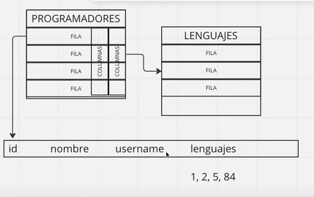

# SQL

:link: Basado en el [curso de MoureDev](https://youtu.be/OuJerKzV5T0)

## Introducción

SQL (structured query language) es un lenguaje de consulta (no de programación) que aparece allá por el 1970 y con el tiempo se convirtió en un estándard (está regulado hace añares por normas ISO, ANSI) en término de lo que son las bases de datos relacionales.


## Motores de bases de datos

Utilizaremos como motor de bases de datos MySQL de Oracle ya que suele ser una de las opciones mas elegida para el aprendizaje y cuenta con un una comunidad muy amplia. Existen otros motores como SQL Server, IBM Db2, Oracle o de código abierto como PostgreSQL, MariaDB, SQLite pero como SQL es un standard una vez que hayamos aprendido un sistema tendremos las bases para aprender cualquier otro.


## Bases de datos relacionales

En las bases de datos relacionales tenemos tablas y cada objeto de estas tablas tiene relaciones entre sí y mediante SQL podremos consultar todos estos datos de una manera eficiente. Por ejemplo podremos tener una tabla usuarios y una tabla películas y de algún modo podremos relacionar las películas vistas por un determinado usuario. 


> Las bases de datos deberán gestionar el hecho de que muchos usuarios accedan a ellas. Incluso de manera concurrente donde un usuario modifique un dato en la app web y esto deba repercutir en los otros entornos de manera instantánea.


## DBMS

Los DBMS (*database management systems*) como su nombre lo indica son sistemas de gestión de bases de datos que implementan el funcionamiento del estándard SQL. Utilizaremos MySQL. Debemos tener presente que cada uno de ellos tendrán particularidades en la implementación.


## Fundamentos de bases de datos

En las bases de datos almacenaremos información que estará organizada en entidades organizadas en una o mas tablas.



Por ejemplo en este caso en la tabla PROGRAMADORES en la columna lenguajes no escribiremos Python, Go, Rust sino que haremos diferencia a los ids de dichos elementos en la tabla lenguajes.


* Relaciones 1:1

Un libro puede tener solo un ISBN (suponiendo que tenemos una tabla de esas entidades).


* Relaciones 1:n

Un programador puede saber n lenguajes.


* Relaciones n:n

Un libro puede tener varios autores y un autor puede tener varios libros.


## Tipos de datos

En las bases de datos podremos definir tipos de datos para cada columna de acuerdo a la naturaleza de lo que queramos almacenar (edad -> número, etc). Existen algunos que son soportados por todos los motores de bases de datos  y luego algunos adicionales para cosas concretas.

Podemos encontrar un [listado de los de MySQL en W3schools](https://www.w3schools.com/mysql/mysql_datatypes.asp).


# Configuración MySQL

Utilizaremos como RDBMS (relational database management system) a MySQL. En la página oficial de MySQL [descargamos la versión community](https://dev.mysql.com/downloads/) (tener en cuenta que cuenta con opciones Enterprise que son las que aparecen mas fácilmente). Luego elegimos la opción [MySQL Community Server](https://dev.mysql.com/downloads/mysql/)

Luego de correr el instalador tendremos la base de datos y ahora necesitaremos un cliente. Como podremos ver [en la documentación](https://dev.mysql.com/doc/refman/8.0/en/mysql.html) podremos interacturar con la db con distintos comandos. 


En Windows debemos abrir MySQL 8.3 Command Line Cli y al ingresar nos pedirá el password.


## Mostrar bases de datos

```
show databases;
```


## Cerrar cliente

```
exit
```

